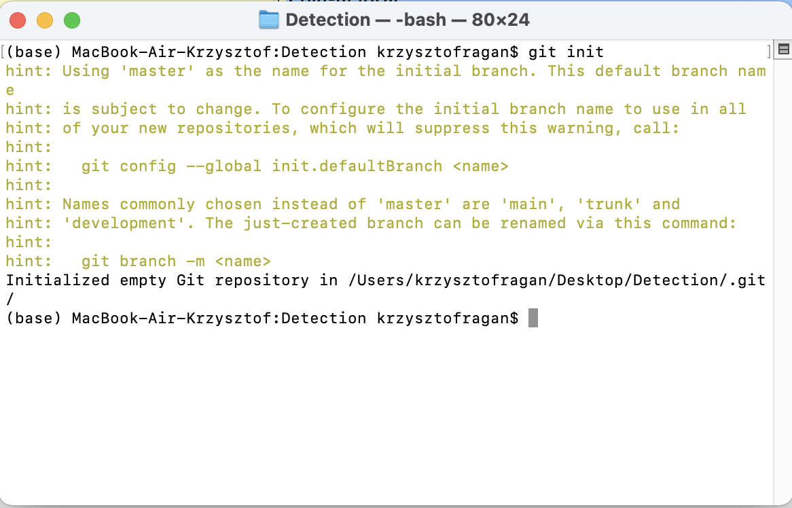
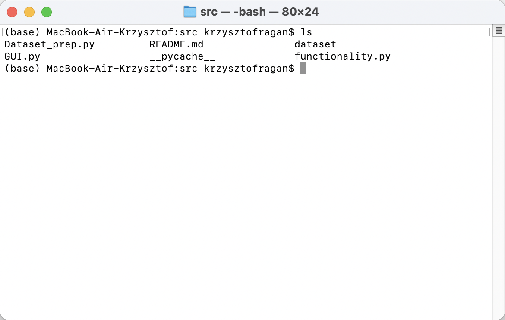
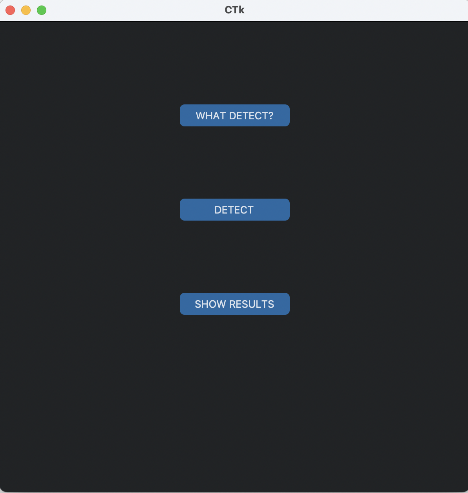
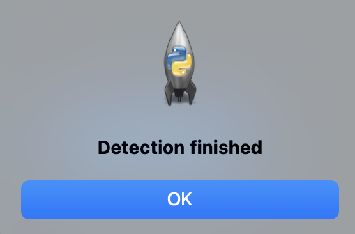
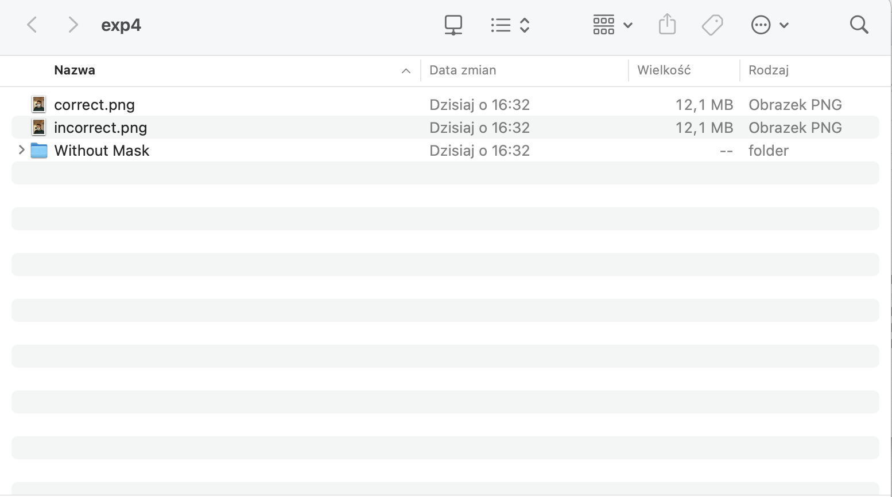

.. Face Detection Mask documentation master file, created by
   sphinx-quickstart on Fri Jul  8 21:10:26 2022.
   You can adapt this file completely to your liking, but it should at least
   contain the root `toctree` directive.

WELCOME TO FACE DETECTION MASK'S DOCUMENTATION!
===============================================
This is Face Mask Detection program, that uses yolov5 neural network to detect if people on the photos are using face masks, are using them wrong, or don't have them!

link to yolov5: https://github.com/ultralytics/yolov5

INSTALATION
-----------
**Instruction for MacOS Users**

Make folder, where you would like to have whole program. Then User has to initialize `github <https://github.com>`_.

It is done by typing in terminal in specific directory *git init*. 

Next step is clone repository from github. 

command: *git clone https://github.com/KrzysztofRagan/Face-Mask-Detection/tree/main*

When all files of program will be in proper directory, User has to install python environment and packages that are used to run the program. Program can be opened by python3. 

**Instalation of python**

Just go on original `python website <https://www.python.org>`_ and download python. 

**Instalation of packages**

By using pip, User can download all packages, that are necessary to run a program.

`pip installation <https://www.geeksforgeeks.org/how-to-install-pip-in-macos/>`_

To download packages User has to type in terminal *pip install package_name*

**Packages used in program:**

- customtkinter
- tkinter

PROGRAM RUNNING
---------------
To run the program User has to be in *src* directory  in terminal (where are located python programs such as GUI.py and functionality.py).

To RUN the program type in terminal *downloaded version of python GUI.py* (for example *python3.10 GUI.py*). 

If User wants to choose photos, that are going to be detected the button "WHAT DETECT?" shoul be pressed and picked up folder, where User stores photos. 

After pickig up the folder button "DETECT" should be pressed. It will run the process of detection. 

After information about finished detection photos are possible to see under button "SHOW RESULTS"

There is created folder named *exp_latest_number*, where User has possibility to see retults of detection on photo. In this folder is created also folder named *Without Mask*, where are put photos, on which person / people do not wear masks.  

**RESULTS**

Program creates frame on face on each person. After it decides in which state is person:

- With Mask
- Without Mask
- Mask worn incorrectly

Example of detection, where person has mask worn correctly:

.. image:: images/correct.png
.. toctree::
   :maxdepth: 2
   :caption: Contents:
   
   modules